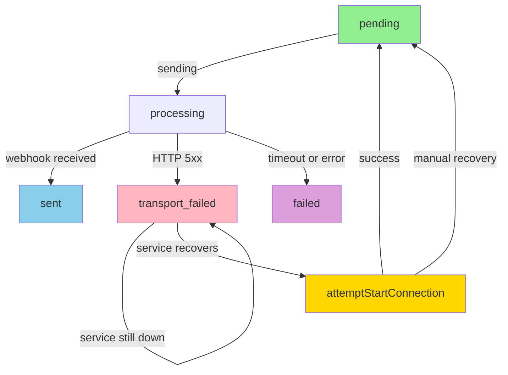

# Flujo de Recuperación Automática de Conexión WhatsApp

## Arquitectura Simplificada

### 1. **Health Check - Simple State Verification**

El endpoint `/api/whatsapp/health` ahora es **simple**: solo verifica y retorna el estado actual.

```http
POST http://localhost:5111/api/whatsapp/health
X-API-Key: dev_local_2026_digimedia

Response 200 OK:
{
  "success": true,
  "connected": false,
  "webhooksOperational": false,
  "apiKeyValid": true,
  "timestamp": "2026-03-23T21:34:00Z"
}
```

**Respuesta**: Siempre HTTP 200 con estado actual (o HTTP 503 con error)

---

### 2. **Orchestrator - Intelligent Decision Making**

El orchestrador en Laravel es el que toma decisiones basadas en el estado:

```php
// En recoverStaleChunks():
$health = WhatsappHealthService::checkHealth();

// ¿Webhooks están caídos?
if (!$health['webhooksOperational'] && $health['apiKeyValid']) {
    // SÍ → Intentar reactivar
    $this->attemptStartConnection();
    
    // Re-verificar salud después de reactivación
    $health = WhatsappHealthService::checkHealth();
}

// ¿Ahora está lista la conexión?
if (!$health['connected']) {
    // NO → Skipear esta ronda, reintentar en siguiente ciclo
    return;
}

// SÍ → Proceder con recuperación y envío de chunks
$this->retryTransportFailedChunks();
```

---

### 3. **Start Connection - Reactivate Service**

Nuevo endpoint que **reactiva** el servicio:

```http
POST http://localhost:5111/api/whatsapp/start-connection
X-API-Key: dev_local_2026_digimedia

Response 200 OK:
{
  "success": true,
  "message": "Connection started",
  "alreadyConnected": false,
  "timestamp": "2026-03-23T21:34:00Z"
}
```

**Protección**: Requiere API Key + rol `system` o `administrador`

---

## Flujo Completo: Ante una Campaña con Transport Failed

### Escenario:
- Chunk ID=10 está en estado `transport_failed` (WhatsApp caído hace 30 minutos)
- WhatsApp service se levantó hace 5 minutos
- Orchestrator corre cada minuto

### Pasos:

```
[20:34:00 - Orchestrator Cycle]
│
├─ 1️⃣ Llamar /api/whatsapp/health
│   └─ Recibe: connected=false, webhooksOperational=false, apiKeyValid=true
│
├─ 2️⃣ Detectar: webhooksOperational=false (BUT apiKeyValid=true)
│   └─ Decisión: Intentar reactivación
│
├─ 3️⃣ Llamar /api/whatsapp/start-connection
│   ├─ Node.js reinicia conexión WhatsApp
│   ├─ Reconecta socket
│   ├─ Verifica webhook machinery
│   └─ Espera respuesta
│
├─ 4️⃣ Orchestrator espera 3 segundos (sleep)
│   └─ Permite que el servicio estabilice
│
├─ 5️⃣ Re-verificar con /api/whatsapp/health
│   └─ Recibe: connected=true, webhooksOperational=true, apiKeyValid=true ✅
│
├─ 6️⃣ Proceder a recuperación:
│   ├─ retryTransportFailedChunks() encuentra chunk_id=10
│   ├─ Cambia de 'transport_failed' → 'pending'
│   ├─ Lo programa para reintentar inmediatamente
│   └─ Log: recovery.transport_failed.requeued
│
└─ 7️⃣ En siguiente iteración: Chunk ID=10 se envía exitosamente ✅
```

---

## Estados de Chunk



---

## Logs Esperados

### Cuando White⚠️ está caído:
```log
[2026-03-23 21:34:00] local.DEBUG: whatsapp.health_check.success {"connected":false,"webhooksOperational":false,"apiKeyValid":true}
[2026-03-23 21:34:00] local.INFO: recovery.skipped.service_down {"reason":"Health check failed","webhooksOperational":false,"apiKeyValid":false}
```

### Cuando se detecta y se reactiva:
```log
[2026-03-23 21:35:00] local.DEBUG: whatsapp.health_check.success {"connected":false,"webhooksOperational":false,"apiKeyValid":true}
[2026-03-23 21:35:00] local.INFO: 🔌 Webhooks down - attempting to start connection...
[2026-03-23 21:35:00] local.INFO: whatsapp.start_connection.success {"message":"Connection started"}
[2026-03-23 21:35:03] local.DEBUG: whatsapp.health_check.success {"connected":true,"webhooksOperational":true,"apiKeyValid":true}
[2026-03-23 21:35:03] local.INFO: recovery.connection_reactivation_attempted {"webhooksOperational":true,"connected":true}
[2026-03-23 21:35:03] local.INFO: recovery.transport_failed.requeued {"chunk_id":10,"campaign_id":10,"reason":"service_recovered"}
```

### Cuando el chunk se reintenta exitosamente:
```log
[2026-03-23 21:36:00] local.INFO: whatsapp.chunk.sent {"chunk_id":10,"campaign_id":10,"response":{...}}
[2026-03-23 21:36:05] local.INFO: whatsapp.campaign.completed {"campania_id":10,"fecha_fin":"2026-03-23 21:36:05"}
```

---

## Configuración de Timing

| Parámetro | Valor | Propósito |
|-----------|-------|----------|
| **Health Check Cache** | 30 segundos | Evita hammering el servicio |
| **Retry Wait** | 3 segundos | Tiempo para que se estabilice conexión |
| **Start Connection Timeout** | 5 segundos | Límite de espera para inicio |
| **Stale Chunk Threshold** | 120 segundos | Detecta chunks stuck en processing/sent |

**Configurable en** `config/whatsapp.php` o `.env`

---

## Flujo de Seguridad con API Key

```
┌─────────────────────────────────────────┐
│   Laravel (Orchestrator)                │
│   WHATSAPP_SERVICE_API_KEY=dev_local... │
└──────────────┬──────────────────────────┘
               │
               ├─ POST /api/whatsapp/health
               │  Header: X-API-Key: dev_local...
               │
               ├─ POST /api/whatsapp/start-connection
               │  Header: X-API-Key: dev_local...
               │
               └─ Middleware en Node.js valida:
                  1. req.headers['x-api-key'] exists?
                  2. === process.env.API_KEY?
                  3. → req.user.isSystemJob=true
                  4. → Permite acceso
```

---

## Testing

### Ver health check actual:
```bash
php scripts/test_health_endpoint.php
```

### Probar start-connection manualmente:
```bash
curl -X POST http://localhost:5111/api/whatsapp/start-connection \
  -H "X-API-Key: dev_local_2026_digimedia" \
  -H "Content-Type: application/json" \
  -d '{}'
```

### Ver logs en tiempo real:
```bash
# Terminal 1: Laravel
tail -f storage/logs/laravel.log | grep -i "recovery\|health\|start_connection"

# Terminal 2: Node.js
npm start 2>&1 | grep -i "health\|connection"
```

---

## Ventajas del Nuevo Diseño

✅ **Health Check Simple**: Solo verifica estado, sin decisiones lógicas  
✅ **Decisiones en Orchestrator**: Lógica centralizada y auditada en Laravel  
✅ **Recuperación Automática**: Detecta y reactiva sin intervención manual  
✅ **Mejor Logging**: Cada paso documentado para debugging  
✅ **Reutilizable**: Otros servicios pueden usar el mismo patrón  

---

## Última Actualización
- **Fecha**: 2026-03-23
- **Cambios**: Simplificado health check, agregado start-connection, mejorado orchestrator recovery
- **Status**: ✅ Implementado y listo para testing
